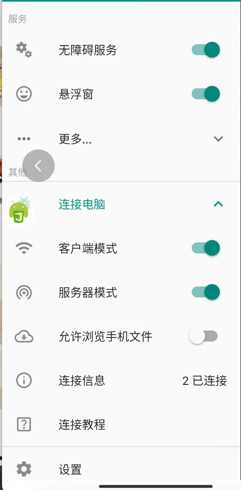
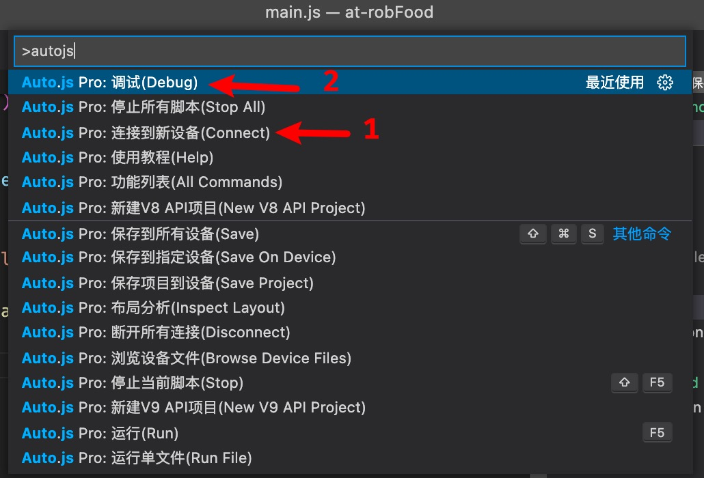

本项目纯属学习~不要违规违法造成法律责任概不负责。
现在支持叮咚买菜，盒马，盒马团购和美团的自动抢菜，它只是帮你狂点，并不能保证一定能抢到菜。
仅支持安卓手机。

## 使用

1. 推荐使用 vscode 编辑器
2. 安装 vscode 插件 Auto.js-Pro-Ext
3. 安装项目依赖
   `npm 版本 8.1.0`
   `npm install`
4. 手机上安装 [autojs app](https://autojspro-apk-1252460104.cos.ap-guangzhou.myqcloud.com/autojspro8.0-latest.apk), 这软件需要注册会员，45元，我这里有个账号可以支持2个设备登陆，可以联系我获得（只支持微信好友）
5. 打开 autojs app，打开无障碍服务、链接电脑：客户端模式和服务器模式都打开（手机和电脑连接相同的 wifi）
   
6. vscode 连接到新设备
7. vscode 选择刚刚连接的设备进行调试
   

> __建议使用叮咚，叮咚对各种情况都有判断和处理，6点在叮咚上抢菜时，手动点击和这个插件点击相比这个插件点击明显可以走的更远一点，但是依然没有抢到菜__

> __最后抢到菜的方法是：叮咚上面，9点左右我想着会不会有人脑子抽了退单了，于是一直开着插件，这个插件可以自动查找可以配送的时间段，如果有空余的就自动进入付款页面，大概10分钟左右就自动跳转到付款页面了__

> 盒马团购只支持抢可以团购的菜品里面的第一个

> 美团买菜没有正式抢过或者调试过，可能不支持网络繁忙等情况

> 如果想更换运行的脚本，需要把`package.json`和`project`的`main`字段修改为对应的文件名